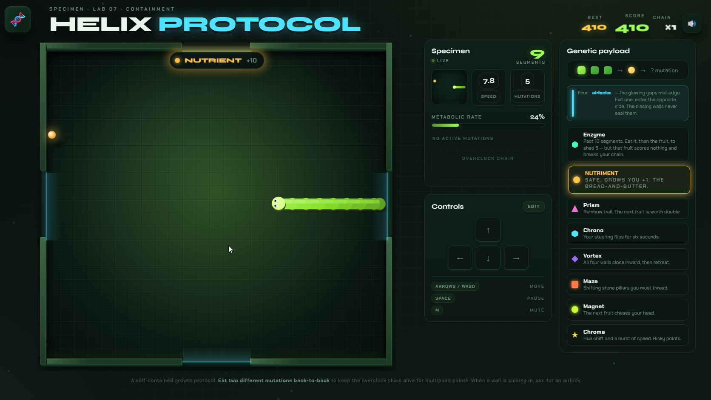

# HELIX PROTOCOL

**Snake, but the fruit fights back.**

A neon lab-containment take on the arcade classic, built as a single self-contained HTML file. Most of the fruit on the board isn't food — it's a **mutation**, and every one of them rewrites the arena while you're still driving through it. Walls close in. Your steering reverses. Stone pillars sprout. The fruit runs away from you, or straight at you.

You have one job: don't bite yourself. It gets complicated.

---

## Play it

Download `helix-protocol-v16.html` and open it in any modern browser. That's the whole install.

No build step, no bundler, no `npm install`, no server. One file, ~95 KB, everything inside it: the game, the audio, the art, the UI. It runs from a `file://` URL on a plane.

---

## Why it's not just Snake

Classic Snake has one rule and one threat: you. Helix Protocol keeps that — the self-collision, the tightening body, the creeping speed — and then adds a board that refuses to sit still.

Six mutations rotate in, and the same one never spawns twice in a row, so you're constantly context-switching:

| | Mutation | What it does to you |
|---|---|---|
| ▲ | **Prism** | Rainbow trail. Your **next** fruit is worth double — so bank it on something big. |
| ⬡ | **Chrono** | Your steering flips for six seconds. Up is down. The snake didn't change; you did. |
| ◆ | **Vortex** | All four walls march inward, hold, then retreat. Twelve seconds of shrinking world. |
| ■ | **Maze** | Five stone pillars materialise and you thread them for ten seconds. |
| ● | **Magnet** | The next fruit hunts *your head*. Great, until it drags you into your own tail. |
| ★ | **Chroma** | Hue shift plus a burst of raw speed. The highest-scoring pickup, and the one most likely to kill you. |

Plus two things that aren't mutations at all:

- **Nutriment** — the plain orange one. Safe, +1 length, bread-and-butter points.
- **Enzyme** — appears once your body is long enough to be a liability. Eat it, then eat the fruit, and that fruit **digests five segments away** instead of growing you. The catch: that fruit scores nothing and breaks your chain. Space costs points. That's the trade.

### The Overclock Chain

This is the hook. Eat two **different** mutations back-to-back and the chain fires — every subsequent mutation multiplies, stacking up to **×6**. Take a plain Nutriment, or cash in an Enzyme, and the chain collapses to ×1.

So the whole game becomes a running argument with yourself. Your body is twenty-something segments long, the vortex is closing, and there's a Chroma on the far side of the board worth 180 points at your current multiplier. Do you go for it, or do you take the safe orange one and start over at ×1?

You go for it. You always go for it. That's the game.

### Airlocks

Four glowing gaps sit dead-centre on each edge of the containment field. Exit one, enter the opposite side. Crucially, **the closing walls never seal them** — when the vortex is crushing you, there is always a way out if you can reach it. Learning to route through the airlocks under pressure is the difference between a 300 and a 1700.

---

## Controls

| Input | Action |
|---|---|
| **Arrow keys** / **WASD** | Move |
| **Space** or **P** | Pause |
| **M** | Mute |
| **Enter** | Start / restart |
| **Swipe** | Move (touch) |
| **Tap** | Start / pause (touch) |

Arrow keys are fully **rebindable** — hit **Edit** on the Controls panel and press whatever you want. WASD stays live as a second hand position regardless. Bindings persist between sessions.

The game auto-pauses if you switch tabs or the window loses focus, so nothing dies while you're answering Slack.

---

## Features

- **25 × 23 grid** that scales to fill your window at any zoom level
- **Interpolated movement** — the body glides between cells instead of stuttering
- **Progressive speed** from 5.5 to 12.75 cells/sec, tracked live on the Metabolic Rate meter
- **Procedural audio** — every sound is synthesised with the Web Audio API. Nothing is loaded from disk
- **Local high score** persisted via `localStorage`
- **Cause of death** on every game over screen, because you deserve to know exactly how it happened
- **Onboarding that respects you** — your first two Chronos spawn away from walls and show a temporary reversed keypad, then the training wheels come off for good
- **Fair-by-design hazards** — pillars never spawn in the lane ahead of you or in an airlock mouth, and the closing vortex will not claim a cell your body is still sitting in. Every death is yours

---

## Scoring

| Pickup | Base points |
|---|---|
| Nutriment | 10 |
| Enzyme | 15 |
| Prism / Chrono / Vortex / Maze / Magnet | 25 |
| Chroma | 30 |

Multiply by your chain (up to ×6), then double it again if a Prism is banked. A single well-timed Chroma at full chain is worth 360.

---

## Technical notes

- **Zero dependencies.** Plain HTML, CSS, and vanilla JavaScript in one file. Rendered on `<canvas>` with a `requestAnimationFrame` loop.
- **One network request**, and it's optional: Google Fonts for the display typefaces. Offline, the game falls back to system fonts and plays identically.
- Tested in current Chrome, Firefox, Safari, and Edge. Works on mobile via swipe, best on a tablet or larger.
- No analytics, no tracking, no accounts. Nothing leaves your machine.

## Hosting it yourself

Drop the HTML file anywhere static — GitHub Pages, Netlify, an S3 bucket, a folder on your desktop. Rename it to `index.html` if you want it served at the root of a Pages site.

## Contributing

Issues and pull requests welcome. The source is heavily commented and organised into clear sections (config → state → audio → geometry → spawning → input → eating → simulation → rendering → HUD → controls), so it's a reasonable file to hack on even at ~1900 lines. Tuning constants live together at the top: speed curve, effect durations, chain cap, airlock width, enzyme rules.

## License

Released under the [MIT License](LICENSE). Do what you like with it — play it, fork it, host it, mutate it.

---

*A self-contained growth protocol. Eat two different mutations back-to-back to keep the overclock chain alive. When a wall is closing in, aim for an airlock.*
